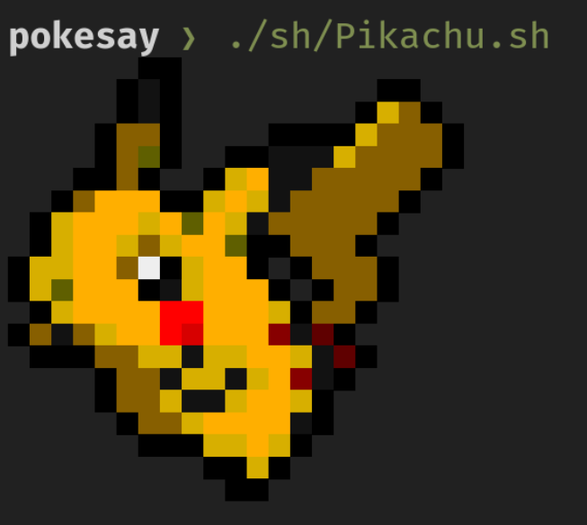

# Pokesay



Stupid scripts that does this:

* Scrapes https://bulbapedia.bulbagarden.net/wiki/List_of_Pokémon_by_National_Pokédex_number
* Downloads the sprite PNGs to ./sprites
* Trims the PNGs using imagemagick
* Converts the PNGs to `.cow` files for cowsay into `./cows`
* Converts the PNGs to `.sh` files for executables that will print to terminal. `./sh`

## Requirements

* Elixir and Erlang installed
* [img2xterm]
* [imagemagick]

[img2xterm]: https://github.com/XenGi/img2xterm
[imagemagick]: https://imagemagick.org

## Usage

Start with `iex -S mix`

```elixir
# Grab the PNGs first.
Pokesay.scrape()

# Then convert them to what you want.
Pokesay.generate_bash()
Pokesay.generate_cows()
```

Once you have your generated pokemon bash files, you can do nifty things like
randomly print on when you open your terminal

```sh
# First copy the pokemon files into some more permanent location
cp -Rv ./sh ~/.pokesay

# in ~/.zlogin or ~/.bash_login
if [ -d "$HOME/.pokesay" ]; then
  source "$(find "$HOME/.pokesay" -type f | shuf -n 1)"
fi
```

## Credits

https://github.com/possatti/pokemonsay
